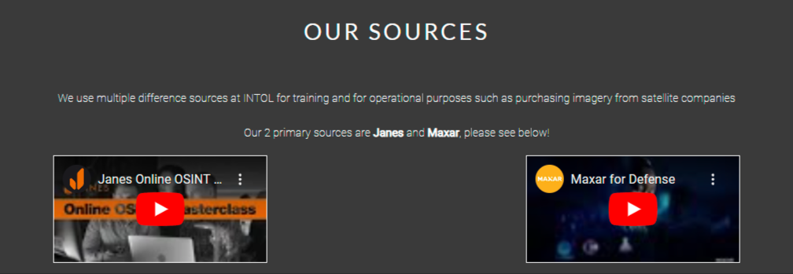
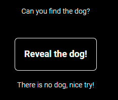
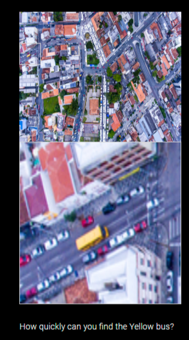
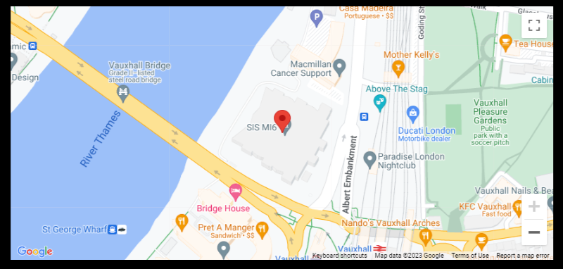
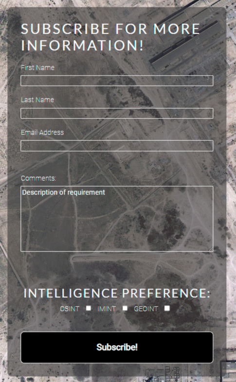

# INTOL

INTOL is a site that provides intelligence solutions for customers. There is an initial focus on 3 different capabilities, Imagery intelligence, Geospatial Intelligence and Open Source Intelligence. These types of intelligence are relatively unknown but with the right exposure, could be hugely beneficial to business/individuals condicting activities in a vulnerable area ir region. The website sheds light on what the different types of intelligence are, the products that can be created and the training that respective analysts go through to be qualified.

This is Milestone Project 1 for Code Institute's Diploma in Web Application Development course. This website features five pages and is built using technologies that I have learnt since staring the course including HTML and CSS and also contains Javascript.

Link to live site: https://ojalaw.github.io/INTOL-MP1/ 

---

## CONTENTS

* [User Experience](#user-experience-ux)
  * [User Stories](#user-stories)

* [Design](#design)
  * [Colour Scheme](#colour-scheme)
  * [Typography](#typography)
  * [Layout](#layout)
  * [Imagery](#imagery)
  * [Wireframes](#wireframes)
  * [Future Updates](#future-updates)

* [Features](#features)
  * [General Features on Each Page](#general-features-on-each-page)
  * [Future Implementations](#future-implementations)
  * [Accessibility](#accessibility)

* [Technologies Used](#technologies-used)
  * [Languages Used](#languages-used)
  * [Frameworks, Libraries & Programs Used](#frameworks-libraries--programs-used)

* [Deployment](#deployment)
    * [How to Fork](#how-to-fork)
    * [How to Clone](#how-to-clone)

* [Testing](#testing)

* [Credits](#credits)
  * [Code Used](#code-used)
  * [Content](#content)
  * [Media](#media)
  * [Acknowledgments](#acknowledgments)
  
  ---

## User Experience (UX)

### User Stories

User Story 1: Customer Seeking Intelligence Solutions
As a potential customer, I want to easily understand what INTOL offers and how it can benefit me. I want to quickly navigate through the website to find information on the different capabilities and products, and have a clear idea of what to expect from working with INTOL.

User Story 2: Analyst Looking to Join INTOL Team
As an analyst interested in joining the INTOL team, I want to learn more about the company's background and values, as well as the experience and qualifications required for the role. I want to easily find the relevant information and have a clear understanding of the application process.

User Story 3: Existing Customer Seeking Support
As an existing customer of INTOL, I want to be able to easily access support resources in case I encounter any issues or have questions about the products. I want to have a clear understanding of the support process and be able to quickly get in touch with the support team if needed.

User Story 4: Journalist Investigating a Story
As a journalist investigating a story, I want to learn about INTOL's capabilities and products related to open source analysis. I want to easily find the relevant information on the website and have a clear idea of how INTOL's services can be useful for my investigation.

## Design

### Colour Scheme

The color scheme of the INTOL website is focused on shades of grey and white, with the following color variables defined in the CSS:

The use of these colors creates a clean and modern look that is easy on the eyes and helps to highlight the content on the website. In future updates, we may consider adding a bright color accent to the color scheme to create more visual interest.

### Typography

The INTOL website uses two Google Fonts for typography: Lato and Roboto. Lato is used for headings and titles, while Roboto is used for body text. Both fonts were chosen for their modern look and excellent legibility, which makes reading and navigation on the website easy and comfortable.

### Layout
The layout of the INTOL website is built using the Bootstrap framework, which provides a responsive grid system that allows the website to adapt to different screen sizes and devices. The use of a grid system helps to create a consistent layout across all pages of the website, which makes navigation and exploration more intuitive for visitors.

### Imagery

I spent a great deal of time when it came to selecting the images for use on the site. I believe that the images chosen are consistent with the general design theme of the site and are all of the highest quality possible. All images have been compressed to speed up processing times, predominantly on mobile devices.

Imagery on the site was sourced from Shutterstock and Adobestock and Pixabay.

### Wireframes

### Future updates
As the INTOL website continues to evolve, we will continue to refine and improve the design based on feedback from our users and our own observations. We are committed to creating a website that is not only visually appealing but also easy to use and navigate, and we look forward to continuing to develop and improve our design over time.

Overall, the design of the INTOL website is clean, modern, and easy to use. We believe that our color scheme, typography, layout, and other visual elements help to communicate the values and capabilities of INTOL in a clear and compelling way, and we look forward to continuing to refine and improve our design in the future.

## Features

### General features on each page

**Navigation bar:**  
**Feature 01** The top navigation bar makes it easy for users to find their way around the website and access other pages. On a smaller screen size, there will be a collapsible navbar. The active page should appear bold and on hover, the text should be underlined, this applies to both desktop and collapsible nav bars.    

**Social media links:**  
**Feature 02** The footer section includes links to INTOL's social media profiles on Facebook, Instagram, and Twitter, as well as a copyright notice. Each social media site should appear white, on hover, it should turn black and when clicked, should open in a new tab.  

### General features on individual pages

**Hero image**  
**Feature 03** The hero section includes an image and text that welcomes visitors to the website. The hero image is designed with a fade-in effect that animates the image's appearance on the page.
**Find Out More 'button'**  
**Feature 04** 'Find out more' button which sits on top of the hero image. The button should be black with a white border and white text. On hover, the button should appear white and the text should be black.  

**Spinning earth animation**    
**Feature 05** Earth sphere animation: A standout design element on the page is the spinning Earth sphere animation, which provides a dynamic and eye-catching visual element that reinforces INTOL's global focus. There is no user interaction but the image should continue to spin and will also be present on mobile devices and smaller screens.  

**Capabilities button**  
**Feature 06** The capabilities button provides a direct link to the capabilities page, where visitors can learn more about INTOL's intelligence solutions. The button should be black with a white border and white text. On hover, the button should appear white and the text should be black.

**Hyperlink to Janes and Maxar**  
**Feature 07** Hyperlinks to [Janes](https://www.janes.com/defence-and-security-advisory/janes-osint-training) and [Maxar](https://www.maxar.com/) which are both in bold and are underlined when hovered over with the cursor.

**iframes**  
**Feature 08** Janes and Maxar iframes that should open in a new link when clicked, a white border should also appear when hovered over by the cursor.  

**Event listener 'reveal the dog' button**
**Feature 09** A message should appear below the button informing users that there isn't actually a dog in the image. I included this to improve user experience, however, i don't expect users to be best pleased when they realise there isn't actually a dog iin the image.  

  

**Image zoom test**
**Feature 10**  There should be two images, one above the other. The image at the top should be a zoomed out image of an urban area, the image below it should be a zoomed in version of that image, the zoomed area should correspond to whatever area the cursor is hovering over on the top image. Hence providing an image zoom test. This will not display on devices below 1200px wide.  I included this feature as i felt it linked in with the opportunity theme and can give users a taste of what being an IMINT analyst might be like, i believe this improves user experience.  

  

**Google Maps API**
**Feature 11**  There should be an area towards the bottom of the page that includes a google maps inset with a marker present at the site of the recruitment fair at SIS building. There should be an option to expand the map out to fullscreen and when places on the map are clicked, user should be prompted to 'view on google maps' this should open google in a new tab. I included this to notify users of where the next recruitment fair would be taking place, in my experience, it is common for google maps to be present on sites in a situation like this.  

  

**Subscribe button**
**Feature 12** There should be a subscribe button that is black with a white border and white text.On hover, it should change to a white button with black text and when clicked should take users to the subscribe page. I included this as it helps with the flow of the page, i have given users a taste of what an imagery intelligence job might entail, i have notified them of a recruitment fair in a certain location and by using the subscribe button underneath, i am giving users the opportunity to move to the subscribe page with ease.  

 

**Subscription form**
**Feature 13**  I have included this form to give users the opportunity to subscribe to INTOLs services and give them an option to select what intelligence discipline users may be interested in. Users may be interested in services provided or they may be interested in career opportunities, in any case, the comments box gives users the opportunity to outline their exact requirement. The different text boxes should transform to a black outline on hover and there should be a placeholder 'description of requirement' in the comments box. There should be 3 radio checkboxes that can be checked. The subscribe button should be black with a white border and white text, on hover, the button should turn white with black text, like other buttons on the site. Subscribing in its current state will result in a new tab showing the results that have been typed by https://formdump.codeinstitute.net/.     

   

### Future Implementations

Historic archive of products, future capabilities will have their own section.  
Light and dark versions of the site.  
Adding a bright color accent.  

### Accessibility

## Technologies Used

### Languages Used

**HTML5**  
Used for creation of markup for the website content.  
**CSS**  
Cascading style sheets used to style the inidividual pages.  
**Javascript**  
Scripting language used to make aspects of the site interactive.

### Frameworks, Libraries & Programs Used

[Bootstrap 5.3.0](https://getbootstrap.com/)  
Bootstrap was used to assist with the responsiveness and styling of the website.

[jQuery](https://jquery.com/)  
jQuery came with Bootstrap to make the navbar responsive.

[CDN jsdelivr](https://www.jsdelivr.com/)  
CDN jsdeliver was used to serve static assets bootstrap and jquery to improve peformance and reliability.

[Google Fonts](https://fonts.google.com/)  
Google fonts were used to import Lato and Roboto fonts which is used on all pages throughout the project.

[Font awesome](https://fontawesome.com/)  
Font Awesome was used on all pages throughout the website to add icons for aesthetic and UX purposes.

[Github](https://github.com/)   
GitHub is used to store the projects code after being pushed from Git.

[Drawio](https://draw.io)  
Drawio was used to create the wireframes during the design process.

Visual Studio Code  
Visual Studio Code was use to create files pages and where i produced the code for the project.

[Compressor.io](https://compressor.io)  
Compressor.io was used to reduce the size of images, this was recommended during validation.

[Canva](https://www.canva.com/en_gb/)  
Canva design tool was used to increase the exposure on my hero image to ensure it was consistent with the theme of the site. 

[Google Chrome Dev Tools](https://developer.chrome.com/docs/devtools/)    
Google Chrome Dev Tools was used during the testing phase to test the responsiveness of the site and to check for any bugs.

[Shutterstock](https://www.shutterstock.com/), [AdobeStock](https://stock.adobe.com/uk/) and [Pixabay](https://pixabay.com/)  
These sites were used to source the imagery for my site.

[W3schools](https://www.w3schools.com/)    
W3schools was used to sourece javascript for my site and for certain CSS aspects (mentioned below).

[PageSpeed Insights](https://pagespeed.web.dev/)   
PageSpeed Insights was used as a backup to Google Chrome Dev tools when lighthouse testing my site.

## Testing

There were some bugs that were highlighted during testing phase.

- iframes overflowed the container.
- Form on the subscription page was not responsive in the way I orginally intended.
- Images on the opportunity page were not responsive.
- The nav bar was very cluttered on smaller screens meaning i needed to change the breakpoint for the collapsible navbar.

Validation testing

## Deployment

**How was this site deployed?**

The website was initially deployed on GitHub pages.

**Deploying on GitHub Pages**  
To deploy the website on GitHub Pages, the following steps were followed:

**Create a new repository on GitHub**  
Add the necessary files to the repository
Go to the settings page of the repository, located on the menu bar towards the top of the page, scroll down to the GitHub Pages section which is located at the bottom of the 'Code and automation' sub-section.
Select the main branch and the root folder, then click save
The website will now be live at the URL provided in the GitHub Pages section

**How to clone the repository**

Go to the https://github.com/ojalaw/INTOL-MP1 repository on GitHub
Click the "Code" button to the right of the screen, click HTTPs and copy the link there
Open a GitBash terminal and navigate to the directory where you want to locate the clone
On the command line, type "git clone" then paste in the copied url and press the Enter key to begin the clone process

## Credits

### Code Used

Bootstrap v5.3.0

Code Institute training material

**Javascript**  

All javascript used on the site is within the opportnunities page and is listed below. I didn't intend on using Javascipt initially, However, as the projkect progressed, i felt it was a necessary addition to improve user experience on the site.  

[Map - Google Maps API](https://developers.google.com/maps/documentation/javascript/adding-a-google-map#javascript)  
 
[Image Zoom test](https://www.w3schools.com/howto/howto_js_image_zoom.asp)   

['Reveal the dog' button - JavaScript HTML DOM EventListener](https://www.w3schools.com/js/js_htmldom_eventlistener.asp)  

**CSS**  

[Hero Image - Fade In](https://www.w3schools.com/w3css/w3css_animate.asp)  

[Rotating Earth - The rotate method](https://www.w3schools.com/css/css3_2dtransforms.asp)  

### Content

Other than the code previously mentioned in the code used section, I was responsible for writing all of the content for the website. Although this is a genuine business idea, at this stage, the company and associated training, recruitment fairs are ficticious, however there are elements of truth in capabilities.

###  Media

ia-analysis - by CESAR Henriqwue Noda (Shutterstock)  
Road - by user 'patsch.1' (Shutterstock)  
Marina - by user 'Meaning' (Shutterstock)  
Arab Spring - by user 'akramalrasny' (Shutterstock)  
Social Media - by user 'rvlsoft' (Shutterstock)  
Map of Europe - by user 'Meda01' (Shutterstock)  
Spinning Earth - by 'Yellow duck' (Adobe Stock)  
Hero-image - by 'Placidplace' (Pixabay)

  
###  Acknowledgments

Code Institute  
Mentor

