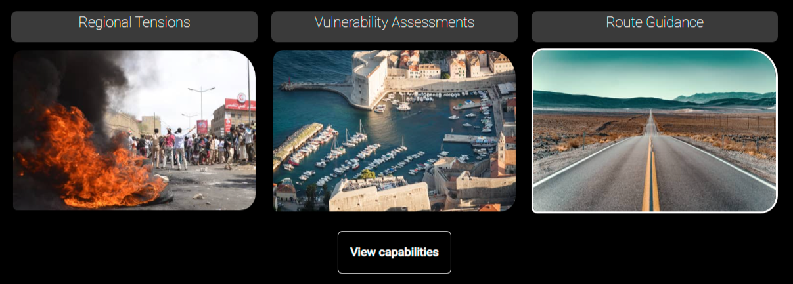
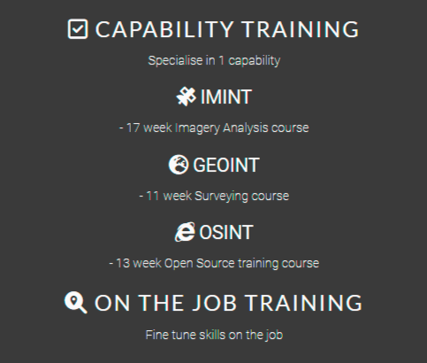

# INTOL

INTOL is a site that provides intelligence solutions for customers. There is an initial focus on 3 different capabilities, Imagery intelligence, Geospatial Intelligence and Open Source Intelligence. These types of intelligence are relatively unknown but with the right exposure, could be hugely beneficial to business/individuals condicting activities in a vulnerable area ir region. The website sheds light on what the different types of intelligence are, the products that can be created and the training that respective analysts go through to be qualified.

This is Milestone Project 1 for Code Institute's Diploma in Web Application Development course. This website features five pages and is built using technologies that I have learnt since staring the course including HTML and CSS and also contains Javascript.

Link to live site: https://ojalaw.github.io/INTOL-MP1/ 

---

## CONTENTS

* [User Experience](#user-experience-ux)
  * [User Stories](#user-stories)

* [Design](#design)
  * [Colour Scheme](#colour-scheme)
  * [Typography](#typography)
  * [Layout](#layout)
  * [Imagery](#imagery)
  * [Wireframes](#wireframes)
  * [Future Updates](#future-updates)

* [Features](#features)
  * [General Features on Each Page](#general-features-on-each-page)
  * [Future Implementations](#future-implementations)
  * [Accessibility](#accessibility)

* [Technologies Used](#technologies-used)
  * [Languages Used](#languages-used)
  * [Frameworks, Libraries & Programs Used](#frameworks-libraries--programs-used)

* [Deployment](#deployment)
    * [How to Fork](#how-to-fork)
    * [How to Clone](#how-to-clone)

* [Testing](#testing)

* [Credits](#credits)
  * [Code Used](#code-used)
  * [Content](#content)
  * [Media](#media)
  * [Acknowledgments](#acknowledgments)
  
  ---

## User Experience (UX)

### User Stories

User Story 1: Customer Seeking Intelligence Solutions
As a potential customer, I want to easily understand what INTOL offers and how it can benefit me. I want to quickly navigate through the website to find information on the different capabilities and products, and have a clear idea of what to expect from working with INTOL.

User Story 2: Analyst Looking to Join INTOL Team
As an analyst interested in joining the INTOL team, I want to learn more about the company's background and values, as well as the experience and qualifications required for the role. I want to easily find the relevant information and have a clear understanding of the application process.

User Story 3: Existing Customer Seeking Support
As an existing customer of INTOL, I want to be able to easily access support resources in case I encounter any issues or have questions about the products. I want to have a clear understanding of the support process and be able to quickly get in touch with the support team if needed.

User Story 4: Journalist Investigating a Story
As a journalist investigating a story, I want to learn about INTOL's capabilities and products related to open source analysis. I want to easily find the relevant information on the website and have a clear idea of how INTOL's services can be useful for my investigation.

## Design

### Colour Scheme

The color scheme of the INTOL website is focused on shades of grey and white, with the following color variables defined in the CSS:

The use of these colors creates a clean and modern look that is easy on the eyes and helps to highlight the content on the website. In future updates, we may consider adding a bright color accent to the color scheme to create more visual interest.

### Typography

The INTOL website uses two Google Fonts for typography: Lato and Roboto. Lato is used for headings and titles, while Roboto is used for body text. Both fonts were chosen for their modern look and excellent legibility, which makes reading and navigation on the website easy and comfortable.

### Layout
The layout of the INTOL website is built using the Bootstrap framework, which provides a responsive grid system that allows the website to adapt to different screen sizes and devices. The use of a grid system helps to create a consistent layout across all pages of the website, which makes navigation and exploration more intuitive for visitors.

### Imagery

I spent a great deal of time when it came to selecting the images for use on the site. I believe that the images chosen are consistent with the general design theme of the site and are all of the highest quality possible. All images have been compressed to speed up processing times, predominantly on mobile devices.

Imagery on the site was sourced from Shutterstock and Adobestock and Pixabay.

### Wireframes

### Future updates
As the INTOL website continues to evolve, we will continue to refine and improve the design based on feedback from our users and our own observations. We are committed to creating a website that is not only visually appealing but also easy to use and navigate, and we look forward to continuing to develop and improve our design over time.

Overall, the design of the INTOL website is clean, modern, and easy to use. We believe that our color scheme, typography, layout, and other visual elements help to communicate the values and capabilities of INTOL in a clear and compelling way, and we look forward to continuing to refine and improve our design in the future.

## Features

### General features on each page

**Navigation bar:** F01 The top navigation bar makes it easy for users to find their way around the website and access other pages. 

**Social media links:** F02 The footer section includes links to INTOL's social media profiles on Facebook, Instagram, and Twitter, as well as a copyright notice.

### General features on individual pages

**Home page**
**Hero section:** F03 The hero section includes a stunning image and text that welcomes visitors to the website. The hero image is designed with a fade-in effect that animates the image's appearance on the page.

**Statement section:** F04 The statement section provides a brief overview of INTOL's capabilities and values, and includes images that showcase the types of intelligence solutions provided by the company.
Earth sphere animation: A standout design element on the page is the spinning Earth sphere animation, which provides a dynamic and eye-catching visual element that reinforces INTOL's global focus.

**Capabilities button:** F05 The capabilities button provides a direct link to the capabilities page, where visitors can learn more about INTOL's intelligence solutions.

**About us**
**Statement section:** The statement section provides a brief introduction to INTOL and its intelligence capabilities.
"INTOL at a glance" section: This section provides a brief overview of INTOL's key capabilities, including global satellite coverage, a wide range of assets, an archive of historic products, and 20+ years of military experience.
"Our Selection Process" section: This section explains INTOL's selection process for analysts, including assessment of qualifications, experience, and aptitude.
"Our Training" section: This section describes the training process for analysts at INTOL, including basic intelligence principle training, capability training, and on-the-job training.
"Our Sources" section: This section explains the sources INTOL uses for training and operational purposes, including Janes and Maxar.

I purposely chose to keep this page is simplistic as possible, inlcluding Fontawesome icons to make the site more visually appealing.

The purpose of this page was to be more informative than visually appealing, I appreciate that this could be achieved by using images/other methods, however i didn't want my site to be made up solely by CSS and images and felt that it was necessary to include text on the 'About us' Page.

**Capabilities**
The capabilities page contains information about INTOL's three main intelligence capabilities: IMINT, GEOINT, and OSINT.
Each capability is presented in a section with an image and a description of the technique used and the products produced.
The page also includes a section on future capabilities, with information about INTOL's plans to offer cyber, financial, and human intelligence services.
The sections on the page alternate the side of the page they appear on for an appealing flow, I went with a symbolic approach with the spherical capability images, i wanted them to appear as though they were viewed through a spy glass in keeping with the intelligence theme.

**Opportunities**
Title: The title of the page is "Opportunities". It appears at the top of the page and provides users with a clear idea of what the page is about.
Information about Recruitment: The page provides information about a recruitment drive for an office setting up in London, as well as IMINT positions that will be opening up in Q3 2023.
Image Zoom: The page features an image zoom function that allows users to zoom in on an image by hovering their mouse over it. This is achieved through the use of JavaScript.
Images: The page contains two images, one of a crowd at a sports stadium and another of an IA analysis.
Test: The page features a test in which users are asked to find a specific object in an image.
Call-to-action: The page includes a call-to-action button that encourages users to subscribe for more information about job opportunities at INTOL.

Overall, the page is designed to provide users with information about job opportunities at INTOL, as well as to encourage them to subscribe for more information. It makes use of various design features, such as a navigation bar, images, and a call-to-action button, to engage users and make it easy for them to find the information they need.

**Subscribe**
Form section: The page contains a form that users can fill out to subscribe to the INTOL newsletter and receive more information about the company. The form includes fields for the user's first and last name, email address, and comments. There is also a section for users to select their intelligence preference (OSINT, IMINT, GEOINT, or All) using checkboxes.
Subscribe button: At the bottom of the form, there is a button that users can click to submit their subscription information.
Text section: The page also includes a text section that provides information about the cost of INTOL's services and the benefits of subscribing for more information.

### Future Implementations

Historic archive of products, future capabilities will have their own section.

### Accessibility

## Technologies Used

### Languages Used

HTML, CSS and Javascript.

### Frameworks, Libraries & Programs Used

**Bootstrap 5.3.0  
Bootstrap was used to assist with the responsiveness and styling of the website.

**jQuery  
jQuery came with Bootstrap to make the navbar responsive.

**[Google Fonts](https://fonts.google.com/)  
Google fonts were used to import Lato and Roboto fonts which is used on all pages throughout the project.

**[Font awesome](https://fontawesome.com/)  
Font Awesome was used on all pages throughout the website to add icons for aesthetic and UX purposes.

**[Github](https://github.com/)   
GitHub is used to store the projects code after being pushed from Git.

**[Drawio] (https://draw.io)   
Drawio was used to create the wireframes during the design process.

**Visual Studio Code  
Visual Studio Code was use to create files pages and where i produced the code for the project.

**[Compressor.io] (https://compressor.io)  
Compressor.io was used to reduce the size of images, this was recommended during validation.

**[Canva] (https://www.canva.com/en_gb/)  
Canva design tool was used to increase the exposure on my hero image to ensure it was consistent with the theme of the site. 

**[GoogleChromeDevTools] (https://developer.chrome.com/docs/devtools/)    
Google Chrome Dev Tools was used during the testing phase to test the responsiveness of the site and to check for any bugs.

**[Shutterstock] (https://www.shutterstock.com/), [AdobeStock] (https://stock.adobe.com/uk/) and [Pixabay] (https://pixabay.com/)  
These sites were used to source the imagery for my site.

**[W3schools] (https://www.w3schools.com/)    
W3schools was used to sourece javascript for my site and for certain CSS aspects (mentioned below).

**[PageSpeed Insights] (https://pagespeed.web.dev/)   
PageSpeed Insights was used as a backup to Google Chrome Dev tools when lighthouse testing my site.

## Testing

There were some bugs that were highlighted during testing phase.

- iframes overflowed the container.
- Form on the subscription page was not responsive in the way I orginally intended.
- Images on the opportunity page were not responsive.
- The nav bar was very cluttered on smaller screens meaning i needed to change the breakpoint for the collapsible navbar.

Validation testing

## Deployment

**How was this site deployed?**

The website was initially deployed on GitHub pages.

**Deploying on GitHub Pages**
To deploy the website on GitHub Pages, the following steps were followed:

**Create a new repository on GitHub**
Add the necessary files to the repository
Go to the settings page of the repository, located on the menu bar towards the top of the page, scroll down to the GitHub Pages section which is located at the bottom of the 'Code and automation' sub-section.
Select the main branch and the root folder, then click save
The website will now be live at the URL provided in the GitHub Pages section

**How to clone the repository**

Go to the https://github.com/ojalaw/INTOL-MP1 repository on GitHub
Click the "Code" button to the right of the screen, click HTTPs and copy the link there
Open a GitBash terminal and navigate to the directory where you want to locate the clone
On the command line, type "git clone" then paste in the copied url and press the Enter key to begin the clone process

## Credits

### Code Used

Bootstrap

Code Institute 

Javascript

All javascript used on the site is within the opportnunities page and is listed below. I didn't intend on using Javascipt initially, However, as the projkect progressed, i felt it was a necessary addition to improve user experience on the site.

[Map - Google Maps API] - https://developers.google.com/maps/documentation/javascript/adding-a-google-map#javascript  
 
[Image Zoom test] https://www.w3schools.com/howto/howto_js_image_zoom.asp  

['Reveal the dog' button - JavaScript HTML DOM EventListener] https://www.w3schools.com/js/js_htmldom_eventlistener.asp  

CSS

[Hero Image - Fade In] - https://www.w3schools.com/w3css/w3css_animate.asp  

[Rotating Earth - The rotate method] - https://www.w3schools.com/css/css3_2dtransforms.asp  

### Content

Other than the code previously mentioned in the code used section, I was responsible for writing all of the content for the website. Although this is a genuine business idea, at this stage, the company and associated training, recruitment fairs are ficticious, however there are elements of truth in capabilities.

###  Media

ia-analysis- by CESAR Henriqwue Noda (Shutterstock)  
Road - by user 'patsch.1' (Shutterstock)  
Marina - by user 'Meaning' (Shutterstock)  
Arab Spring - by user 'akramalrasny' (Shutterstock)  
Social Media - by user 'rvlsoft' (Shutterstock)  
Map of Europe - by user 'Meda01' (Shutterstock)  
Spinning Earth - by 'Yellow duck' (Adobe Stock)  
Hero-image - by 'Placidplace' (Pixabay)

  
###  Acknowledgments

Code Institute
Mentor

