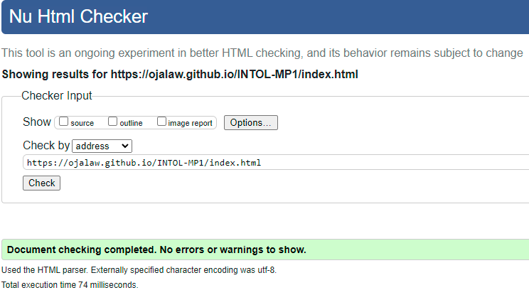
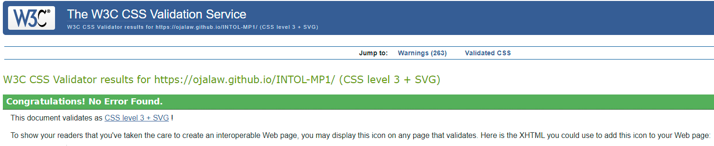

# Testing

## Contents

This site has been tested using the following testing procedures

* [Code Validation](#Code-validation)  

* [Lighthouse Testing](#Lighthouse-Testing)

* [Browser Comaptibility](#Browser-Compatibility)

* [Manual Testing](#Manual-Testing)

* [Bug Reporting](#Bug-Reporting)

## Code Validation  

The site was run through both W3C and W3C CSS validators.

  

The results above apply to all pages, no errors were identified in the HTML files, see links to results below.  

Index page - https://validator.w3.org/nu/?doc=https%3A%2F%2Fojalaw.github.io%2FINTOL-MP1%2Findex.html  
About us - https://validator.w3.org/nu/?doc=https%3A%2F%2Fojalaw.github.io%2FINTOL-MP1%2Fabout-us.html  
Capabilities - https://validator.w3.org/nu/?doc=https%3A%2F%2Fojalaw.github.io%2FINTOL-MP1%2Fcapabilities.html  
Opportunities - https://validator.w3.org/nu/?doc=https%3A%2F%2Fojalaw.github.io%2FINTOL-MP1%2Fopportunities.html  
Subscribe - https://validator.w3.org/nu/?doc=https%3A%2F%2Fojalaw.github.io%2FINTOL-MP1%2Fsubscribe.html  

  

No errors were identified in the CSS file, see link to results below.  

CSS - https://jigsaw.w3.org/css-validator/validator  

## Lighthouse Testing  

I used lighthouse testing via Google Chrome Developer Tools and PageSpeed Insights.  

The site is tested against the following criteria;  

- Performance  
- Accessibility  
- Best Practices  
- Search Engine Optimization  

**Index**  

- Index desktop lighthouse score [here](README-images/index-desktop-lighthouse.png "Optional title")  
- Index mobile lighthouse score [here](README-images/index-mobile-lighthouse.png "Optional title")  

**About us**  

 - About us desktop lighthouse score [here](README-images/about-us-desktop-lighthouse.png "Optional title")  
 - About us mobile lighthouse score [here](README-images/about-us-mobile-lighthouse.png "Optional title")  

**Capabilities**  

- Capabilities desktop lighthouse score [here](README-images/capabilities-desktop-lighthouse.png "Optional title")  
- Capabilities mobile lighthouse score [here](README-images/capabilities-mobile-lighthouse.png "Optional title")  

**Opportunities**  

- Opportunities desktop lighthouse score [here](README-images/opportunities-desktop-lighthouse.png "Optional title")  
- Opportunities mobile lighthouse score [here](README-images/opportunities-mobile-lighthouse.png "Optional title")  

**Subscribe**  

- Subscribe desktop lighthouse score [here](README-images/subscribe-desktop-lighthouse.png "Optional title")  
- Subscribe mobile lighthouse score [here](README-images/subscribe-mobile-lighthouse.png "Optional title")  

## Browser Compatibility 
  
**Desktop**  
  
| Browser            | Version                                               | Bugs  |
| -------------      |:-------------:                                        | -----:|
| Google Chrome      | Version 112.0.5615.138 (Official Build) (64-bit)      | None  |
| Microsoft Edge     | Version 112.0.1722.58 (Official build) (64-bit)       | None  |
| Firefox            | 112.0.1 (64-bit)                                      | None  |  
  
**Mobile**  

| Device                   | Operating system | Bugs  |
| -------------            |:-------------:   | -----:|
| iPhone 12                | iOS 16.3.1       | None  |
| iPhone 13                | iOS 16.0         | None  |
| Samsung galaxy S22 Ultra | Android 13       | None  |

## Manual Testing  

During the manual testing, I tested the sites functionality, usability and responsiveness.  

#### Functionality

**Home page**  

Nav bar desktop  
- Links functioned as expected.  
- The active page appeared in bold on the nav bar as expected.  
- Nav bar section changed on hover as expected.  

Nav bar mobile  
- Collapsible Nav bar appeared at the correct width.  
- The active page appeared in bold on the nav bar as expected.  

Find Out More button  
- The button navigated to the 'About us' page as expected.  
- The button changes appearance on hover as expected.  

Spinning globe on all devices  
- The spinning globe remains central and continues to spin regardless of the device.
- The spinning globe does not appear strecthed or distorted.  

View capabilities button  
- The button navigated to the capabilities page as expected.  
- The button changes appearance on hover as expected.

Social media links in footer  
- All social media links change appearance on hover as expected.
- All links work and open in new tab as expected.

**About us page**  

External links to Janes and Maxar  
- The links change appearance on hover as expected.
- The links take you to the correct page and open in new tab as expected.  

iframes  
- iframes change appearance on hover as expected.  

**Opportunities page**  
Reveal the dog button  
- The button changes appearance on hover as expected.  
- The button revelas a message underneath when clicked as expected.  

img-zoom  
- The image zoom capability function works as expected.  

Google maps API  
- Google maps API works as expected.  
 
Subscribe button    
- Subscribe button navigates to the subscribe page as expected.
- The button changes appearance on hover as expected.  

**Subscribe**  
Form  
- Background image loads in as expected.
- Text box works as expected.  
- Checkboxes work as expected.  

Subscribe button  
- Subsribe button changes appearance on hover as expected.  
- When clicked, the form is submitted and openened on a new form as expected.  

**Usability**  

Some users found the images at the bottom of the page confusing. They were initally set to display a border on hover but there was no option to click on the actual image.  

**Responsiveness**  

The generic bootstrap break points used within this site are;  

- Extra small: <576px  
- Small: >=576px  
- Medium: >=768px  
- Large: >=992px  
- Extra large: >=1200px    

I also added a media-query at 1200px which effect both the capabilities and opportunities pages. 

There were responsive issues on the Opportunities and Subscribe page, the default margin and padding that Bootstrap uses was causing overflow-x. To correct this, I added more bootstrap which removed the margin and padding. This was required on the capabilities page as I felt that a change was required but it was still too wide for the different capabilities to be stacked on top of eachother. The same breakpoint was required on the opportunities as i could not seem to get the Javascript to work on small devices, to counter this, the feature is hidden on devices less than 1200px and the other image test takes up the entire page.

I also added a breakpoint at 1078px for the iframes on the 'About us' page, this was to correct an issue whereby the iframes were overflowing the container that they were contained within, to correct this i use the repsonisve tool within google chrome dev tools to work out at which point i would need to add a break point.

I added another breakpoint at 320px as the bootstrap was adding default padding and margins that i could not remove completely as the design would not work as intended as screen size increases.

## Bug Reporting

There were a few bugs discovered during the intial testing. I hadn't tested the responsiveness of the site on medium/large screens extensively and as a result;  
- iframes overflowed the container.  
- Form on the subscription page was not responsive in the way I orginally intended.  
- Images on the opportunity page were not responsive.  
- The nav bar was very cluttered on smaller screens meaning i needed to change the breakpoint for the collapsible navbar.  

I made the necessary changes by adding Bootstrap and adapting existing CSS to make the site more responsive for all screen sizes.  

The final bug i discovered was regarding the spinning globe animation on the index page. The animation worked fine on desktop. However, there was an issue on screen sizes below 420px. As the div started to spin, the corner of the div started to overflow the container and push the page horizontally. To correct this, I added code to have the overflow hidden and this solved the issue.

